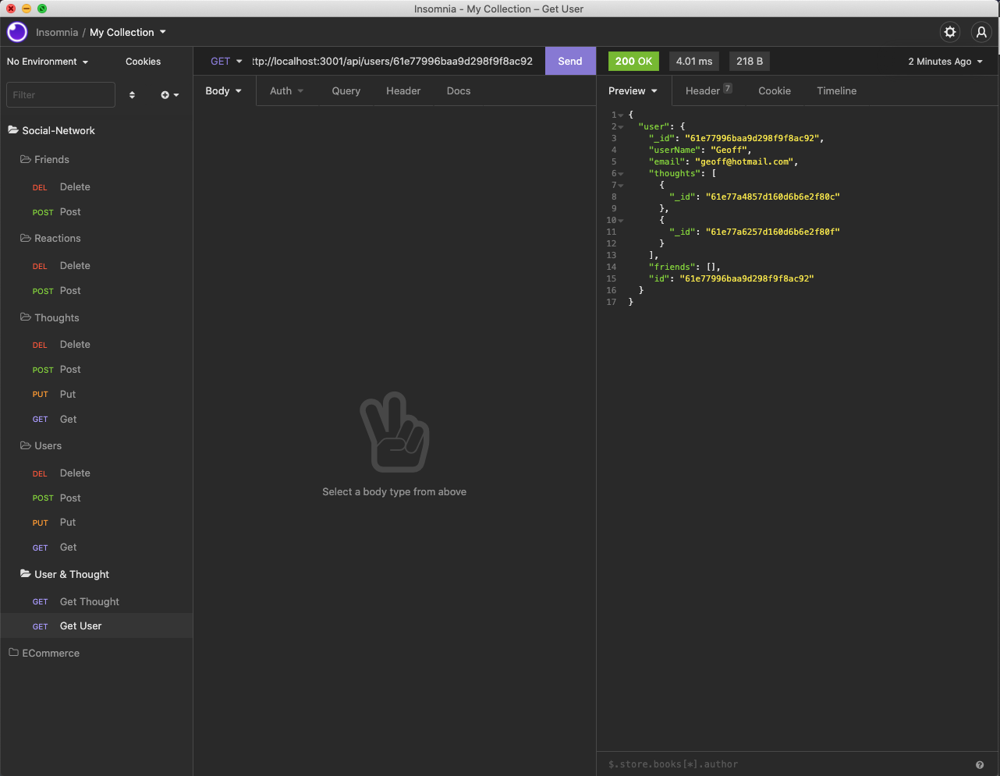

# Social Media Endpoints
  
## Description
  
  * Motivations - to become proficient with routing.
  * Reason for building - Because being skilled at routing is very valuable.
  * Problem solved - it helped me to become more familiar with mongo routing .
  * Lessons learned - many
  
## Table of Contents
  
 - [Installation](#installation)
 - [Usage](#usage)
 - [License](#license)
 - [Contributing](#Contributing)
 - [Tests](#tests)
 - [Questions](#questions)

## Installation

na

## Usage

 * na
  
  
  
  
## License
    
 -undefined
 -

## Contributing
  
 * Please visit the [Contributor Covenant](https://www.contributor-covenant.org/) to view our contributors guidelines.

## Tests

 * na

## Questions

 * For questions regarding this software, please reach out to me on [GitHub](https://github.com/dhoneyman)

## Collaborators

- [undefined](undefined)
- [undefined](undefined)

